# <span style="font-size: 48px;margin:0;margin-bottom:0;padding-bottom:0;">🧀</span> cheese-log

[](https://www.npmjs.com/package/cheese-log)

A colorful logger with browser-/environment-dependent formatting possibilities.

## Features

- Colorize messages
- Custom formatting possible based on log level, browser name, OS, and other attributes
- Display or hide stack trace / origin, timestamp, log level, etc.
- Shorten arrays, shorten strings, limit object depth of deeply nested objects, etc.
- Print tables
- _Set and forget_ mentality, but also allows overriding the logging config for individual logging messages later on
- Written in typescript

This logger is not intended to be highly performant, if you are looking for something like that, look somewhere else. This library aims to provide a flexible, versatile and simple logger, to make debugging etc. a slight bit easier.

## README Overview

1. [Install](#install)
2. [Usage examples](#usage-examples)
   1. [Simple usage](#example-simple-usage)
   2. [Explore some initial config's props](#example-explore-some-initial-configs-props)
   3. [Override config for individual log messages](#example-override-config-for-individual-log-messages)
   4. [Use built-in color functions](#example-use-built-in-color-functions)
   5. [Use context dependent config instead of a static one](#example-use-context-dependent-config-instead-of-a-static-one)
   6. [Use a custom formatMessage function](#example-use-a-custom-formatmessage-function)
   7. [Auto-colorized objects](#example-auto-colorized-objects)
   8. [Shorten strings](#example-shorten-strings)
   9. [Shorten arrays](#example-shorten-arrays)
   10. [Limit object depth](#example-limit-object-depth)
   11. [Print tables](#example-print-tables)
3. [Config / options](#config--options)
4. [Available functions](#available-functions)
   1. [Config function](#config-function)
   2. [Basic logging functions](#basic-logging-functions)
   3. [Built-in table functions](#built-in-table-functions)
   4. [Built-in color functions](#built-in-color-functions)
5. [Open tasks / ideas](#open-tasks--ideas)

## Install

```
npm install --save cheese-log
```

Or if you use Yarn:

```
yarn add cheese-log
```

## Usage examples

The following subsections are showing different usage examples of varying complexity. For a full set of options and possibilities however, refer to the options sections [here](#config--options).

### Example: Simple usage

```typescript
import { cheese, CheeseConfig } from "cheese-log";

// it is mandatory to initialize the cheese logger like so:
const cheeseConfig: CheeseConfig = {};
cheese.config(cheeseConfig);

// now you can use it:
cheese.log("some log message");
cheese.info("some info message");
cheese.debug("some debug message");
cheese.warn("some warn message");
cheese.error("some error message");
```

The corresponding output in the **Google Chrome** browser's console:

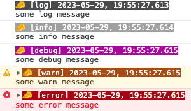

The default configuration of cheese-log avoids color coding in certain browser, that don't support it. For instance, in **Firefox**, instead of seeing messed up logging messages like this...

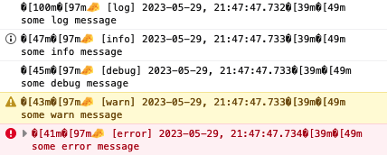

...you will instead see un-colored messages like this:

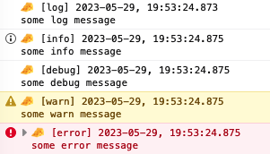

You can always further adjust the mentioned default configuration to avoid colors (or other properties) in certain browsers, operating systems, etc. - see [here](#example-use-context-dependent-config-instead-of-a-static-one).

Further optimizations are part of the implementation. So does it not use the white logging color for message headers in classical consoles - instead, my IDE would show the same messages like this for example:

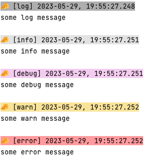

My classical OS terminal would show the output like so:

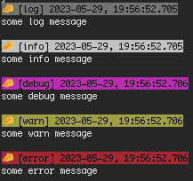

Check out the live demo at [https://stackblitz.com/edit/cheese-log-simple-usage](https://stackblitz.com/edit/cheese-log-simple-usage?file=index.ts).

### Example: Explore some initial config's props:

```typescript
import { cheese, CheeseConfig } from "cheese-log";

const cheeseConfig: CheeseConfig = {
  showDate: false, // is true by default
  showCheeseIcon: false, // is true by default
  showOrigin: true, // is false by default
};
cheese.config(cheeseConfig);

cheese.log("some log message");
cheese.info("some info message");
cheese.debug("some debug message");
cheese.warn("some warn message");
cheese.error("some error message");
```

The corresponding output would hide the timestamp and the icon, while showing some stacktrace info:

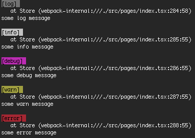

A full list of config options can be found [here](#config--options).

Check out the live demo at [https://stackblitz.com/edit/cheese-log-explore-some-config-props](https://stackblitz.com/edit/cheese-log-explore-some-config-props?file=index.ts).

### Example: Override config for individual log messages

You can override the options for individual messages by using 2 kinds of functions as shown in the following example:

```typescript
import { cheese, CheeseConfig } from "cheese-log";

const cheeseConfig: CheeseConfig = {};
cheese.config(cheeseConfig);

cheese.info("some standard info message");

// 1) _LOGLEVEL functions allow you to pass an option object as the 1st argument...
cheese._info(
  // note the leading underscore!
  { showCheeseIcon: false },
  "some info message where the cheese icon is hidden",
);

// 2) ...while LOGLEVEL_ functions allow you to pass an option object as the last argument:
cheese.info_("some info message where the timestamp is hidden", {
  // note the trailing underscore!
  showDate: false,
});
// ^ Note that you could pass multiple arguments to `._info()` - cheese-log assumes the last argument will be your option object.
```

The corresponding output would be:

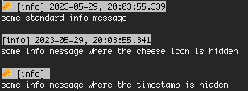

Check out the live demo at [https://stackblitz.com/edit/cheese-log-override-config](https://stackblitz.com/edit/cheese-log-override-config?file=index.ts).

### Example: Use built-in color functions

Cheese-log offers some coloring possibilities. While certain coloring happens automatically for objects, you can always override the color by using the option `colorOverride`. On top of that, to make the coder's life easier, you can instead also use the predefined log functions in the shape `[LOGLEVEL][COLOR]()`, like the following example shows:

```typescript
import { cheese, CheeseConfig } from "cheese-log";

const cheeseConfig: CheeseConfig = {};
cheese.config(cheeseConfig);

cheese.logBlack("Some message in a black color");
cheese.logGray("Some message in a gray color");
cheese.logLightgray("Some message in a lightgray color");
cheese.logWhite("Some message in a white color");
cheese.logLightyellow("Some message in a lightyellow color");
cheese.logYellow("Some message in a yellow color");
cheese.logRed("Some message in a red color");
cheese.logLightred("Some message in a lightred color");
cheese.logMagenta("Some message in a magenta color");
cheese.logLightmagenta("Some message in a lightmagenta color");
cheese.logBlue("Some message in a blue color");
cheese.logLightblue("Some message in a lightblue color");
cheese.logCyan("Some message in a cyan color");
cheese.logLightcyan("Some message in a lightcyan color");
cheese.logGreen("Some message in a green color");
cheese.logLightgreen("Some message in a lightgreen color");
```

The corresponding output would be:


You can also use the color functions with leading and trailing underscores, to pass additional options, for instance:

```typescript
cheese._logLightblue({ showCheeseIcon: false }, "hello world");
cheese.logMagenta_("foo bar", "1234", "mic check one two", { showDate: false });
```

Check out the live demo at [https://stackblitz.com/edit/cheese-log-built-in-color-functions](https://stackblitz.com/edit/cheese-log-built-in-color-functions?file=index.ts).

### Example: Use context dependent config instead of a static one

Configs passed to cheese-log can be static option objects as described [here](#config--options) OR you can also pass a function returning such an option object. Advantage of the latter is that you get access to the "context" / the "environment" - meaning, you can make the output and formatting dependent on the browser name (if any), the operating system and other attributes.

The following example should be self-explanatory:

```typescript
import { cheese, CheeseConfig } from "cheese-log";

const contextDependentCheeseConfig: ContextDependentCheeseConfig = (
  who,
  logLevel,
) => {
  if (who.browserName === "Firefox" || who.osName === "Android") {
    return { allColorsDisabled: true, showCheeseIcon: false };
  }
  return {
    allColorsDisabled: true,
    showCheeseIcon: true,
  };
};
cheese.config(contextDependentCheeseConfig);

cheese.info("some info message");
```

The resulting output on Chrome would be...

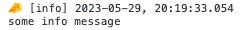

...and on Firefox and/or Android it would be:

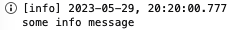

Check out the live demo at [https://stackblitz.com/edit/cheese-log-context-dependent-config](https://stackblitz.com/edit/cheese-log-context-dependent-config?file=index.ts).

### Example: Use a custom formatMessage function

If you want to change the format of logged messages, you can do it by passing a custom `formatMessage` function (either to the global cheese config at the beginning, or to individual log messages).

The function shown below is the default, used by this library. It can serve as a template when creating your own:

```typescript
const formatMessageDefault: FormatMessageFn = (
  message: string,
  who: Who,
  showLogLevel: boolean,
  logLevel: LogLevel,
  millisecondsSince1970: number,
  showDate: boolean,
  dateFormat: string,
  showOrigin: boolean,
  autoColorizeObject: boolean,
  showCheeseIcon: boolean,
  allColorsDisabled: boolean,
  colorOverride: string,
  messagePrefix: string,
  messageSuffix: string,
) => {
  const cheeseIconPrepared = showCheeseIcon ? CHEESE_ICON + " " : "";
  const messagePrefixPrepared = messagePrefix ? messagePrefix + " " : "";
  const logLevelPrepared = showLogLevel
    ? "[" + logLevel + "]" + (showDate ? " " : "")
    : "";
  const datePrepared = showDate
    ? getTimestamp(dateFormat, millisecondsSince1970)
    : "";
  const originInfo = showOrigin ? getStackTrace() ?? "" : "";

  let prefixPrepared = `${cheeseIconPrepared}${messagePrefixPrepared}${logLevelPrepared}${datePrepared}`;
  if (!allColorsDisabled) {
    const textColorFn = who.isServerApp ? black : white;
    if (logLevel === LogLevel.error) {
      prefixPrepared = bgRed(textColorFn(prefixPrepared));
    } else if (logLevel === LogLevel.warn) {
      prefixPrepared = bgYellow(textColorFn(prefixPrepared));
    } else if (logLevel === LogLevel.info) {
      prefixPrepared = bgLightGray(textColorFn(prefixPrepared));
    } else if (logLevel === LogLevel.log) {
      prefixPrepared = bgDarkGray(textColorFn(prefixPrepared));
    } else if (logLevel === LogLevel.debug) {
      prefixPrepared = bgMagenta(textColorFn(prefixPrepared));
    }
  }

  const originInfoPrepared = originInfo ? `   ${originInfo}\n` : "";
  return `${prefixPrepared}\n${originInfoPrepared}${message}${messageSuffix}`;
};
```

**Since version 1.10.0** you can also import `getStackTrace`, `getTimestamp`, which can be helpful when building your own custom message format function.

**Since version 3.0.0** you can also import `chalk` (which is now replacing `ansicolor` package), for coloring your customized output.

Check out the live demo at [https://stackblitz.com/edit/cheese-log-custom-msg-format-function](https://stackblitz.com/edit/cheese-log-custom-msg-format-function?file=index.ts).

### Example: Auto-colorized objects

When logging (nested) objects, the library tries to automatically colorize individual props, according to their type (string would have different colors, than numbers etc.).
See the following example:

```typescript
import { cheese, CheeseConfig } from "cheese-log";

cheese.config({});

cheese.log({
  this: {
    is: { someNested: "object" },
    itHasNumbers: 112358,
    andArrays: ["hello", "world"],
  },
});
```

The result:

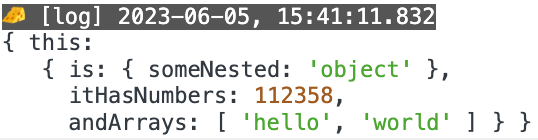

### Example: Shorten strings

Cheese-log allows you to automatically truncate strings that exceed certain lengths.

```typescript
import { cheese, CheeseConfig } from "cheese-log";

const cheeseConfig: CheeseConfig = { maxStringLength: 12 };
cheese.config(cheeseConfig);

cheese.logBlack("Some longer message - in a black color");
cheese.logGray("Some longer message - in a gray color");
cheese.logLightgray("Some longer message - in a lightgray color");
cheese.logWhite("Some longer message - in a white color");
cheese.logLightyellow("Some longer message - in a lightyellow color");
cheese.logYellow("Some longer message - in a yellow color");
cheese.logRed("Some longer message - in a red color");
cheese.logLightred("Some longer message - in a lightred color");
cheese.logMagenta("Some longer message - in a magenta color");
cheese.logLightmagenta("Some longer message - in a lightmagenta color");
cheese.logBlue("Some longer message - in a blue color");
cheese.logLightblue("Some longer message - in a lightblue color");
cheese.logCyan("Some longer message - in a cyan color");
cheese.logLightcyan("Some longer message - in a lightcyan color");
cheese.logGreen("Some longer message - in a green color");
cheese.logLightgreen("Some longer message - in a lightgreen color");
```

The corresonding output would be:

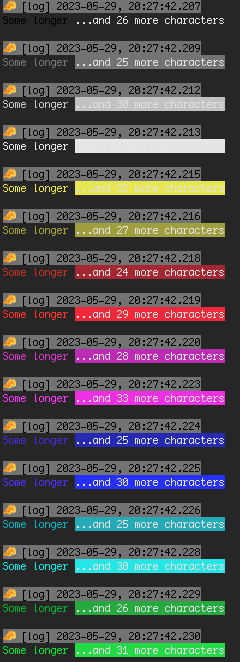

Check out the live demo at [https://stackblitz.com/edit/cheese-log-shorten-strings](https://stackblitz.com/edit/cheese-log-shorten-strings?file=index.ts).

The shortening/truncating of strings also works for values in (nested) objects:

```typescript
cheese.logGreen({
  hello: "world",
  msg: "Some longer message inside an object",
});
```

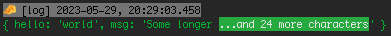

It is allowed to pass `maxStringLength: 0`:

```typescript
import { cheese, CheeseConfig } from "cheese-log";

const cheeseConfig: CheeseConfig = { maxStringLength: 0 };
cheese.config(cheeseConfig);

cheese.logGreen({
  hello: "world",
  msg: "Some longer message inside an object",
});
```

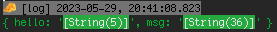

Even when using an uncolored function (which leads to [auto-coloring an object](#example-auto-colorized-objects)), the truncating info in the output will always be highlighted green. The following example logs 2 arguments, a plain string and a nested object -> the latter will be auto-colored, while the plain string will not be auto-colored - see output:

```typescript
cheese.log("a first log argument, which is simply a plain string", {
  hello: "world",
  someArray: [1, 2, 3, 4, 5],
  nested: { hi: "friends and family" },
});
```

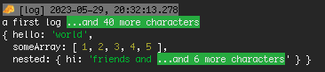

### Example: Shorten arrays

Similarly to string truncating, you can also let cheese-log automatically shorten arrays exceeding certain lengths:

```typescript
import { cheese, CheeseConfig } from "cheese-log";

const cheeseConfig: CheeseConfig = { maxArrayLength: 5 };
cheese.config(cheeseConfig);

cheese.log("some arrays that will be shortened", [1, 2, 3, 4, 5, 6, 7, 8, 9], {
  my: "nested object",
  that: "also holds an array",
  here: ["a", "b", "c", "d", "e", "f", "g", "h", "i", "j", "k"],
});
```

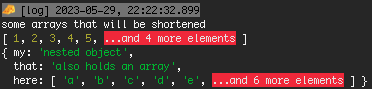

Array shortening messages are always highlighted with a red background, except for cases where `colorOverride` is being used.

Also for arrays, passing `maxArrayLength: 0` is a valid option:

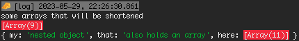

Check out the live demo at [https://stackblitz.com/edit/cheese-log-shorten-arrays](https://stackblitz.com/edit/cheese-log-shorten-arrays?file=index.ts).

### Example: Limit object depth

As developers, we often come across situations where we need to deal with deeply nested objects. Fortunately many browser consoles allow collapsing- and expanding-functionalities. For cases where this is not helpful or possible, cheese-log allows to limit the depth of printed objects:

```typescript
import { cheese, CheeseConfig } from "cheese-log";

const cheeseConfig: CheeseConfig = { depth: 3 };
cheese.config(cheeseConfig);

cheese.info({ this: "is an object with 1 level" });
cheese.info({
  this: "is an object with 2 levels",
  here: { we: "have a 2nd level" },
});
cheese.info({
  this: "is an object with multiple levels",
  here: { we: "have a 2nd level" },
  and: { here: { we: "have a 3rd level" } },
  lets: { maybe: { even: { add: "a 4th level" } } },
  finally: {
    i: { would: { say: { five: "leves are enough for this example" } } },
  },
});
```

The corresponding depth-limited output would be:

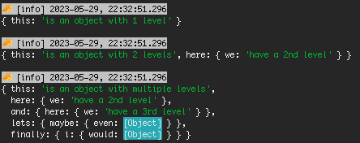

Check out the live demo at [https://stackblitz.com/edit/cheese-log-limit-object-depth](https://stackblitz.com/edit/cheese-log-limit-object-depth?file=index.ts).

### Example: Print tables

If you need to show data in a row/colum way, you can easily print tables with cheese-log.
Make sure you provide an array of objects, where every object features the same set of keys, like so:

```typescript
import { cheese, CheeseConfig } from "cheese-log";

const cheeseConfig: CheeseConfig = { table: true };
cheese.config(cheeseConfig);

cheese.debug([
  { day: "monday", task: "clean house" },
  { day: "tuesday", task: "shopping" },
  { day: "wednesday", task: "write thesis" },
]);
```

The corresponding output would be:

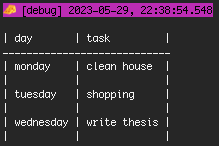

Similarly to the [built-in color functions](#example-use-built-in-color-functions) you can also use **built-in table functions**, so you don't have to pass the `table: true` prop to the config. Another advantage is that it allows you to define the necessary table data structure via typescript, see the following example:

```typescript
type TableData = { colum1: string, column2: string, someNumberColumn: number };

cheese.logTable<TableData>(...);
cheese._logTable<TableData>(...);
cheese.logTable_<TableData>(...);
cheese.infoTable<TableData>(...);
cheese._infoTable<TableData>(...);
// ... etc. -> all combinations of log-levels plus 'Table' exist!
```

You can adjust a few formatting options for tables, by setting a `tableOptions` prop:

```typescript
import { cheese, CheeseConfig } from "cheese-log";

const cheeseConfig: CheeseConfig = {
  table: true,
  tableOptions: { rowSeparator: "-", headerSeparator: "=" },
  depth: 0,
};
cheese.config(cheeseConfig);

cheese.debug([
  { day: "monday", task: "clean house" },
  { day: "tuesday", task: ["shopping", "walk dog"] },
  { day: "wednesday", task: "write thesis" },
  { day: "thursday", task: { a: { nested: "object" } } },
]);
```

The corresponding output would be:

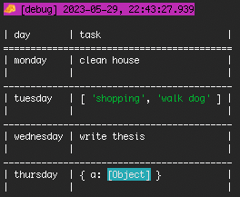

Note how the individual formatting functionalities also work inside individual table cells (the depth of object has been limited in this example).

Check out the live demo at [https://stackblitz.com/edit/cheese-log-print-tables](https://stackblitz.com/edit/cheese-log-print-tables?file=index.ts).

## Config / options

While the section above shows various example, the following table aims to be a complete list of available options.

For now, every single prop is optional, not providing it will result in some default value being used - as shown in the table:

| name                       | type                                                                                                                                                                                                                                                                                         | default value                                                                                                                                | description                                                                                                                                                                                                                                                                                                                            |
| -------------------------- | -------------------------------------------------------------------------------------------------------------------------------------------------------------------------------------------------------------------------------------------------------------------------------------------- | -------------------------------------------------------------------------------------------------------------------------------------------- | -------------------------------------------------------------------------------------------------------------------------------------------------------------------------------------------------------------------------------------------------------------------------------------------------------------------------------------- |
| `allColorsDisabled`        | `boolean \| (who: Who, logLevel: LogLevel) => boolean`                                                                                                                                                                                                                                       | `(who: Who) => who.browserName === "Firefox" \|\| who.browserName === "Safari"`                                                              | If this is set to `true` no ansi colors are being used at all. This is helpful, if your environment is not supporting color codes, for instace. The default value is a function, checking if the logger is running on `Firefox` or `Safari`, in these cases returning `false`, since these browser don't natively support color codes. |
| `autoColorizeObject`       | `boolean \| (who: Who, logLevel: LogLevel) => boolean`                                                                                                                                                                                                                                       | `true`                                                                                                                                       | Logged objects would be automatically colored, as described [here](#example-auto-colorized-objects). You can turn this feature off.                                                                                                                                                                                                    |
| `colorOverride`            | `CheeseColors`                                                                                                                                                                                                                                                                               | `undefined`                                                                                                                                  | This allows you to colorize entire messages. Using this as part of the global config might be a bit useless, you can however highlight individual messages when used on individual log statements.                                                                                                                                     |
| `dateFormat`               | `string \| (who: Who, logLevel: LogLevel) => string`                                                                                                                                                                                                                                         | `"YYYY-MM-DD, HH:mm:ss.SSS"`                                                                                                                 | The date format used for the log statements.                                                                                                                                                                                                                                                                                           |
| `depth`                    | `number \| (who: Who, logLevel: LogLevel) => number`                                                                                                                                                                                                                                         | `100`                                                                                                                                        | The depth of logged objects can be limited, as described [here](#example-limit-object-depth).                                                                                                                                                                                                                                          |
| `escapeWhitespaces`        | `boolean \| (who: Who, logLevel: LogLevel) => boolean`                                                                                                                                                                                                                                       | `false`                                                                                                                                      | If set to `true`, whitespace characters (to be more precise `\t`, `\n`, `\r` and `\f`) will be escaped, when logging. Note, this does not affect classical spaces `" "` though.                                                                                                                                                        |
| `forceNewlines`            | `boolean \| (who: Who, logLevel: LogLevel) => boolean`                                                                                                                                                                                                                                       | `false`                                                                                                                                      | If set to `true` every single logging argument will appear on a new line. If set to `false`, only arrays and objects appear on newlines, successive strings for instance would be printed on the same line though.                                                                                                                     |
| `formatMessage`            | `(message: string, who: Who, showLogLevel: boolean, logLevel: LogLevel, millisecondsSince1970: number, showDate: boolean, dateFormat: string, showOrigin: boolean, autoColorizeObject: boolean, showCheeseIcon: boolean, allColorsDisabled: boolean, colorOverride: CheeseColors) => string` | Check [the corresponding code](https://github.com/maks-io/cheese-log/blob/main/src/log/formatMessageDefault.ts) to see the default function. | This function is one of the centerpieces and determines how logged messages appear. Examples can be seen [here](#example-use-a-custom-formatmessage-function).                                                                                                                                                                         |
| `logLevelEnabled`          | `(logLevel: LogLevel) => boolean`                                                                                                                                                                                                                                                            | `(logLevel: LogLevel) => process.env.NODE_ENV !== "production"`                                                                              | This function can be used to disable certain log messages in certain scenarios, for instance on production environments.                                                                                                                                                                                                               |
| `maxArrayLength`           | `number \| (who: Who, logLevel: LogLevel) => number`                                                                                                                                                                                                                                         | `10000`                                                                                                                                      | Logging long arrays would truncate them automatically via this option. [See more details](#example-shorten-arrays).                                                                                                                                                                                                                    |
| `maxStringLength`          | `number \| (who: Who, logLevel: LogLevel) => number`                                                                                                                                                                                                                                         | `10000`                                                                                                                                      | Logging long strings would truncate them automatically via this option. [See more details](#example-shorten-strings).                                                                                                                                                                                                                  |
| `messagePrefix`            | `string \| (who: Who, logLevel: LogLevel) => string`                                                                                                                                                                                                                                         | `""`                                                                                                                                         | This message prefix allows you to prepend a certain string to every log message. Please be aware, that the cheese icon - if logged - will appear even before this prefix.                                                                                                                                                              |
| `messageSuffix`            | `string \| (who: Who, logLevel: LogLevel) => string`                                                                                                                                                                                                                                         | `""`                                                                                                                                         | This message suffix allows you to append a certain string to every log message.                                                                                                                                                                                                                                                        |
| `reportGlobalConfigChange` | `boolean`                                                                                                                                                                                                                                                                                    | `true`                                                                                                                                       | Changing the global config after initialization might be a mistake, therefore a warning will be presented. This warning can be disabled via this option.                                                                                                                                                                               |
| `reportInitialization`     | `boolean`                                                                                                                                                                                                                                                                                    | `true`                                                                                                                                       | Successfully initializing the logger via `cheese.config()` will print some corresponding info messages. These info messages can be disabled via this option.                                                                                                                                                                           |
| `showCheeseIcon`           | `boolean \| (who: Who, logLevel: LogLevel) => boolean`                                                                                                                                                                                                                                       | `true`                                                                                                                                       | Decides whether log messages show the 🧀 icon or not.                                                                                                                                                                                                                                                                                  |
| `showDate`                 | `boolean \| (who: Who, logLevel: LogLevel) => boolean`                                                                                                                                                                                                                                       | `true`                                                                                                                                       | Decides whether log messages show date / timestamp or not.                                                                                                                                                                                                                                                                             |
| `showLogLevel`             | `boolean \| (who: Who, logLevel: LogLevel) => boolean`                                                                                                                                                                                                                                       | `true`                                                                                                                                       | Decides whether log messages show the logLevel or not.                                                                                                                                                                                                                                                                                 |
| `showOrigin`               | `boolean \| (who: Who, logLevel: LogLevel) => boolean`                                                                                                                                                                                                                                       | `false`                                                                                                                                      | Decides whether log messages show the (stacktrace) origin or not.                                                                                                                                                                                                                                                                      |
| `spaces`                   | `boolean \| (who: Who, logLevel: LogLevel) => boolean`                                                                                                                                                                                                                                       | `true`                                                                                                                                       | Decides if there should be a space `" "` between individual log arguments or not. This only concerns args that would be printed on the same line.                                                                                                                                                                                      |
| `table`                    | `boolean \| (who: Who, logLevel: LogLevel) => boolean`                                                                                                                                                                                                                                       | `false`                                                                                                                                      | Via this option you can print messages in a "table format". Details can be seen [here](#example-print-tables).                                                                                                                                                                                                                         |
| `tableOptions`             | `TableOptions \| (who: Who, logLevel: LogLevel) => TableOptions`                                                                                                                                                                                                                             | `undefined`                                                                                                                                  | Via this option you can control some formatting details for the table printing. The following options are allowed: `outerBorder: string`, `innerBorder: string`, `rowSeparator: string` and `headerSeparator: string`.                                                                                                                 |

## Available functions

### Config function

`config(cheeseConfig: CheeseConfig | ContextDependentCheeseConfig)`

### Basic logging functions

- `log(...args: any[])`
- `info(...args: any[])`
- `debug(...args: any[])`
- `warn(...args: any[])`
- `error(...args: any[])`
- `_log(cheeseConfig: CheeseConfig, ...args: any[])`
- `_info(cheeseConfig: CheeseConfig, ...args: any[])`
- `_debug(cheeseConfig: CheeseConfig, ...args: any[])`
- `_warn(cheeseConfig: CheeseConfig, ...args: any[])`
- `_error(cheeseConfig: CheeseConfig, ...args: any[])`
- `log_(...args: any[], cheeseConfig: CheeseConfig)`
- `info_(...args: any[], cheeseConfig: CheeseConfig)`
- `debug_(...args: any[], cheeseConfig: CheeseConfig)`
- `warn_(...args: any[], cheeseConfig: CheeseConfig)`
- `error_(...args: any[], cheeseConfig: CheeseConfig)`

### Built-in table functions

- `logTable<T>(...args: T[])`
- `infoTable<T>(...args: T[])`
- `debugTable<T>(...args: T[])`
- `warnTable<T>(...args: T[])`
- `errorTable<T>(...args: T[])`
- `_logTable<T>(cheeseConfig: CheeseConfig, ...args: T[])`
- `_infoTable<T>(cheeseConfig: CheeseConfig, ...args: T[])`
- `_debugTable<T>(cheeseConfig: CheeseConfig, ...args: T[])`
- `_warnTable<T>(cheeseConfig: CheeseConfig, ...args: T[])`
- `_errorTable<T>(cheeseConfig: CheeseConfig, ...args: T[])`
- `logTable_<T>(...args: T[], cheeseConfig: CheeseConfig)`
- `infoTable_<T>(...args: T[], cheeseConfig: CheeseConfig)`
- `debugTable_<T>(...args: T[], cheeseConfig: CheeseConfig)`
- `warnTable_<T>(...args: T[], cheeseConfig: CheeseConfig)`
- `errorTable_<T>(...args: T[], cheeseConfig: CheeseConfig)`

^ providing `<T>` is optional and allows you to define the required data structure as needed to avoid bugs. After all every object in the provided array(s) need to have the same props.

### Built-in color functions

- `logBlack(...args: any[])`
- `infoBlack(...args: any[])`
- `debugBlack(...args: any[])`
- `warnBlack(...args: any[])`
- `errorBlack(...args: any[])`
- `_logBlack(cheeseConfig: CheeseConfig, ...args: any[])`
- `_infoBlack(cheeseConfig: CheeseConfig, ...args: any[])`
- `_debugBlack(cheeseConfig: CheeseConfig, ...args: any[])`
- `_warnBlack(cheeseConfig: CheeseConfig, ...args: any[])`
- `_errorBlack(cheeseConfig: CheeseConfig, ...args: any[])`
- `logBlack_(...args: any[], cheeseConfig: CheeseConfig)`
- `infoBlack_(...args: any[], cheeseConfig: CheeseConfig)`
- `debugBlack_(...args: any[], cheeseConfig: CheeseConfig)`
- `warnBlack_(...args: any[], cheeseConfig: CheeseConfig)`
- `errorBlack_(...args: any[], cheeseConfig: CheeseConfig)`
- `logWhite(...args: any[])`
- etc.

^ this works with the following colors: `Black`, `White`, `Gray`, `Lightgray`, `Blue`, `Lightblue`, `Cyan`, `Lightcyan`, `Red`, `Lightred`, `Green`, `Lightgreen`, `Yellow`, `Lightyellow`, `Magenta`, `Lightmagenta`

## Live Demos

All the live demos shown above can be found collected [here](https://stackblitz.com/@maks-io/collections/cheese-log).

Another very basic usage example - this time as part of a **react native app** though - can be found [in this expo snack](https://snack.expo.dev/@maks-io/cheese-log-demo). Open your browser console there to see the log output from cheese-log. Note that it is only visible if you run the snack for the web platform though!

## Open tasks / ideas

- add unit tests
- grouping functionalities
- (async) hook functionality to allow sending logs to external services etc.

## Miscellaneous

Various videos for this library [can be found here](https://www.youtube.com/watch?v=WR0qGktPVys&list=PLz7X-_iH1H1EInL1zYQnv2akysVwn5L7f&pp=iAQB). I am always happy if you pay me a visit on [my channel](https://www.youtube.com/@maks-io)!

## If you enjoy using this...

<a href="https://www.buymeacoffee.com/maks_io" target="_blank"></a>
