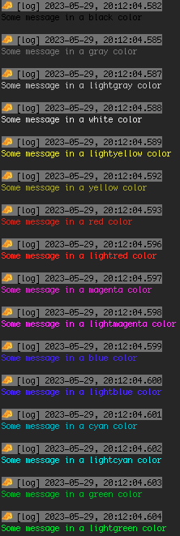

# <span style="font-size: 48px;margin:0;margin-bottom:0;padding-bottom:0;">🧀</span> cheese-log

[](https://www.npmjs.com/package/cheese-log)

A colorful logger with browser-/environment-dependent formatting possibilities.

## Features

- Colorize messages
- Custom formatting possible based on log level, browser name, OS, and other attributes
- Display or hide stack trace / origin, timestamp, log level, etc.
- Shorten arrays, shorten strings, limit object depth of deeply nested objects, etc.
- Print tables
- _Set and forget_ mentality, but also allows overriding the logging config for individual logging messages later on
- Written in typescript

This logger is not intended to be highly performant, if you are looking for something like that, look somewhere else. This library aims to provide a flexible, versatile and simple logger, to make debugging etc. a slight bit easier.

## Install

```
npm install --save cheese-log
```

Or if you use Yarn:

```
yarn add cheese-log
```

## Usage examples

The following subsections are showing different usage examples of varying complexity. For a full set of options and possibilities however, refer to the options sections [here](#config--options).

### Example: Simple usage

```typescript
import cheese, { CheeseConfig } from "cheese-log";

// it is mandatory to initialize the cheese logger like so:
const cheeseConfig: CheeseConfig = {};
cheese.config(cheeseConfig);

// now you can use it:
cheese.log("some log message");
cheese.info("some info message");
cheese.debug("some debug message");
cheese.warn("some warn message");
cheese.error("some error message");
```

The corresponding output in the **Google Chrome** browser's console:


The default configuration of cheese-log avoids color coding in certain browser, that don't support it. For instance, in **Firefox**, instead of seeing messed up logging messages like this...


...you will instead see un-colored messages like this:


You can always further adjust the mentioned default configuration to avoid colors (or other properties) in certain browsers, operating systems, etc. - see [here](#example-use-context-dependent-config-instead-of-a-static-one).

Further optimizations are part of the implementation. So does it not use the white logging color for message headers in classical consoles - instead, my IDE would show the same messages like this for example:


My classical OS terminal would show the output like so:


Check out the live demo at [https://stackblitz.com/edit/cheese-log-simple-usage](https://stackblitz.com/edit/cheese-log-simple-usage?devToolsHeight=33&file=index.ts).

### Example: Explore some initial config's props:

```typescript
import cheese, { CheeseConfig } from "cheese-log";

const cheeseConfig: CheeseConfig = {
  showDate: false, // is true by default
  showCheeseIcon: false, // is true by default
  showOrigin: true, // is false by default
};
cheese.config(cheeseConfig);

cheese.log("some log message");
cheese.info("some info message");
cheese.debug("some debug message");
cheese.warn("some warn message");
cheese.error("some error message");
```

The corresponding output would hide the timestamp and the icon, while showing some stacktrace info:


A full list of config options can be found [here](#config--options).

Check out the live demo at [https://stackblitz.com/edit/cheese-log-explore-some-config-props](https://stackblitz.com/edit/cheese-log-explore-some-config-props?devToolsHeight=33&file=index.ts).

### Example: Override config for individual log messages

You can override the options for individual messages by using 2 kinds of functions as shown in the following example:

```typescript
import cheese, { CheeseConfig } from "cheese-log";

const cheeseConfig: CheeseConfig = {};
cheese.config(cheeseConfig);

cheese.info("some standard info message");

// 1) _LOGLEVEL functions allow you to pass an option object as the 1st argument...
cheese._info(
  // note the leading underscore!
  { showCheeseIcon: false },
  "some info message where the cheese icon is hidden"
);

// 2) ...while LOGLEVEL_ functions allow you to pass an option object as the last argument:
cheese.info_("some info message where the timestamp is hidden", {
  // note the trailing underscore!
  showDate: false,
});
// ^ Note that you could pass multiple arguments to `._info()` - cheese-log assumes the last argument will be your option object.
```

The corresponding output would be:


Check out the live demo at [https://stackblitz.com/edit/cheese-log-override-config](https://stackblitz.com/edit/cheese-log-override-config?devToolsHeight=33&file=index.ts).

### Example: Use built-in color functions

Cheese-log offers some coloring possibilities. While certain coloring happens automatically for objects, you can always override the color by using the option `colorOverride`. On top of that, to make the coder's life easier, you can instead also use the predefined log functions in the shape `[LOGLEVEL][COLOR]()`, like the following example shows:

```typescript
import cheese, { CheeseConfig } from "cheese-log";

const cheeseConfig: CheeseConfig = {};
cheese.config(cheeseConfig);

cheese.logBlack("Some message in a black color");
cheese.logGray("Some message in a gray color");
cheese.logLightgray("Some message in a lightgray color");
cheese.logWhite("Some message in a white color");
cheese.logLightyellow("Some message in a lightyellow color");
cheese.logYellow("Some message in a yellow color");
cheese.logRed("Some message in a red color");
cheese.logLightred("Some message in a lightred color");
cheese.logMagenta("Some message in a magenta color");
cheese.logLightmagenta("Some message in a lightmagenta color");
cheese.logBlue("Some message in a blue color");
cheese.logLightblue("Some message in a lightblue color");
cheese.logCyan("Some message in a cyan color");
cheese.logLightcyan("Some message in a lightcyan color");
cheese.logGreen("Some message in a green color");
cheese.logLightgreen("Some message in a lightgreen color");
```

The corresponding output would be:



You can also use the color functions with leading and trailing underscores, to pass additional options, for instance:

```typescript
cheese._logLightblue({ showCheeseIcon: false }, "hello world");
cheese.logMagenta_("foo bar", "1234", "mic check one two", { showDate: false });
```

Check out the live demo at [https://stackblitz.com/edit/cheese-log-built-in-color-functions](https://stackblitz.com/edit/cheese-log-built-in-color-functions?devToolsHeight=33&file=index.ts).

### Example: Use context dependent config instead of a static one

Configs passed to cheese-log can be static option objects as described [here](#config--options) OR you can also pass a function returning such an option object. Advantage of the latter is that you get access to the "context" / the "environment" - meaning, you can make the output and formatting dependent on the browser name (if any), the operating system and other attributes.

The following example should be self-explanatory:

```typescript
import cheese, { CheeseConfig } from "cheese-log";

const contextDependentCheeseConfig: ContextDependentCheeseConfig = (
  who,
  logLevel
) => {
  if (who.browserName === "Firefox" || who.osName === "Android") {
    return { allColorsDisabled: true, showCheeseIcon: false };
  }
  return {
    allColorsDisabled: true,
    showCheeseIcon: true,
  };
};
cheese.config(contextDependentCheeseConfig);

cheese.info("some info message");
```

The resulting output on Chrome would be...


...and on Firefox and/or Android it would be:


Check out the live demo at [https://stackblitz.com/edit/cheese-log-context-dependent-config](https://stackblitz.com/edit/cheese-log-context-dependent-config?devToolsHeight=33&file=index.ts).

### Example: Use a custom formatMessage function

If you want to change the format of logged messages, you can do it by passing a custom `formatMessage` function (either to the global cheese config at the beginning, or to individual log messages).

The function shown below is the default, used by this library. It can serve as a template when creating your own:

```typescript
formatMessage: (
  message: string,
  who: Who,
  showLogLevel: boolean,
  logLevel: LogLevel,
  millisecondsSince1970: number,
  showDate: boolean,
  dateFormat: string,
  showOrigin: boolean,
  autoColorizeObject: boolean,
  showCheeseIcon: boolean,
  allColorsDisabled: boolean,
  colorOverride: string
) => {
  const cheeseIconPrepared = showCheeseIcon ? CHEESE_ICON + " " : "";
  const logLevelPrepared = showLogLevel ? "[" + logLevel + "] " : "";
  const datePrepared = showDate
    ? dayjs(millisecondsSince1970, "x").format(dateFormat)
    : "";
  const originInfo = showOrigin ? getStackTrace()?.[0] ?? "" : "";

  let prefixPrepared = `${cheeseIconPrepared}${logLevelPrepared}${datePrepared}`;
  if (!allColorsDisabled) {
    const textColorFn = who.isServerApp ? black : white;
    if (logLevel === LogLevel.error) {
      prefixPrepared = bgRed(textColorFn(prefixPrepared));
    } else if (logLevel === LogLevel.warn) {
      prefixPrepared = bgYellow(textColorFn(prefixPrepared));
    } else if (logLevel === LogLevel.info) {
      prefixPrepared = bgLightGray(textColorFn(prefixPrepared));
    } else if (logLevel === LogLevel.log) {
      prefixPrepared = bgDarkGray(textColorFn(prefixPrepared));
    } else if (logLevel === LogLevel.debug) {
      prefixPrepared = bgMagenta(textColorFn(prefixPrepared));
    }
  }

  const originInfoPrepared = originInfo ? `   ${originInfo}\n` : "";
  return `${prefixPrepared}\n${originInfoPrepared}${message}`;
};
```

Check out the live demo at [https://stackblitz.com/edit/cheese-log-custom-msg-format-function](https://stackblitz.com/edit/cheese-log-custom-msg-format-function?devToolsHeight=33&file=index.ts).

### Example: Shorten strings

Cheese-log allows you to automatically truncate strings that exceed certain lengths.

```typescript
import cheese, { CheeseConfig } from "cheese-log";

const cheeseConfig: CheeseConfig = { maxStringLength: 12 };
cheese.config(cheeseConfig);

cheese.logBlack("Some longer message - in a black color");
cheese.logGray("Some longer message - in a gray color");
cheese.logLightgray("Some longer message - in a lightgray color");
cheese.logWhite("Some longer message - in a white color");
cheese.logLightyellow("Some longer message - in a lightyellow color");
cheese.logYellow("Some longer message - in a yellow color");
cheese.logRed("Some longer message - in a red color");
cheese.logLightred("Some longer message - in a lightred color");
cheese.logMagenta("Some longer message - in a magenta color");
cheese.logLightmagenta("Some longer message - in a lightmagenta color");
cheese.logBlue("Some longer message - in a blue color");
cheese.logLightblue("Some longer message - in a lightblue color");
cheese.logCyan("Some longer message - in a cyan color");
cheese.logLightcyan("Some longer message - in a lightcyan color");
cheese.logGreen("Some longer message - in a green color");
cheese.logLightgreen("Some longer message - in a lightgreen color");
```

The corresonding output would be:


Check out the live demo at [https://stackblitz.com/edit/cheese-log-shorten-strings](https://stackblitz.com/edit/cheese-log-shorten-strings?devToolsHeight=33&file=index.ts).

The shortening/truncating of strings also works for values in (nested) objects:

```typescript
cheese.logGreen({
  hello: "world",
  msg: "Some longer message inside an object",
});
```


It is allowed to pass `maxStringLength: 0`:

```typescript
import cheese, { CheeseConfig } from "cheese-log";

const cheeseConfig: CheeseConfig = { maxStringLength: 0 };
cheese.config(cheeseConfig);

cheese.logGreen({
  hello: "world",
  msg: "Some longer message inside an object",
});
```


Even when using an uncolored function (which leads to auto-coloring an object), the truncating info in the output will always be highlighted green. The following example logs 2 arguments, a plain string and a nested object -> the latter will be auto-colored, while the plain string will not be auto-colored - see output:

```typescript
cheese.log("a first log argument, which is simply a plain string", {
  hello: "world",
  someArray: [1, 2, 3, 4, 5],
  nested: { hi: "friends and family" },
});
```


### Example: Shorten arrays

Similarly to string truncating, you can also let cheese-log automatically shorten arrays exceeding certain lengths:

```typescript
import cheese, { CheeseConfig } from "cheese-log";

const cheeseConfig: CheeseConfig = { maxArrayLength: 5 };
cheese.config(cheeseConfig);

cheese.log("some arrays that will be shortened", [1, 2, 3, 4, 5, 6, 7, 8, 9], {
  my: "nested object",
  that: "also holds an array",
  here: ["a", "b", "c", "d", "e", "f", "g", "h", "i", "j", "k"],
});
```


Array shortening messages are always highlighted with a red background, except for cases where `colorOverride` is being used.

Also for arrays, passing `maxArrayLength: 0` is a valid option:


Check out the live demo at [https://stackblitz.com/edit/cheese-log-shorten-arrays](https://stackblitz.com/edit/cheese-log-shorten-arrays?devToolsHeight=33&file=index.ts).

### Example: Limit object depth

As developers, we often come across situations where we need to deal with deeply nested objects. Fortunately many browser consoles allow collapsing- and expanding-functionalities. For cases where this is not helpful or possible, cheese-log allows to limit the depth of printed objects:

```typescript
import cheese, { CheeseConfig } from "cheese-log";

const cheeseConfig: CheeseConfig = { depth: 3 };
cheese.config(cheeseConfig);

cheese.info({ this: "is an object with 1 level" });
cheese.info({
  this: "is an object with 2 levels",
  here: { we: "have a 2nd level" },
});
cheese.info({
  this: "is an object with multiple levels",
  here: { we: "have a 2nd level" },
  and: { here: { we: "have a 3rd level" } },
  lets: { maybe: { even: { add: "a 4th level" } } },
  finally: {
    i: { would: { say: { five: "leves are enough for this example" } } },
  },
});
```

The corresponding depth-limited output would be:


Check out the live demo at [https://stackblitz.com/edit/cheese-log-limit-object-depth](https://stackblitz.com/edit/cheese-log-limit-object-depth?devToolsHeight=33&file=index.ts).

### Example: Print tables

If you need to show data in a row/colum way, you can easily print tables with cheese-log.
Make sure you provide an array of objects, where every object features the same set of keys, like so:

```typescript
import cheese, { CheeseConfig } from "cheese-log";

const cheeseConfig: CheeseConfig = { table: true };
cheese.config(cheeseConfig);

cheese.debug([
  { day: "monday", task: "clean house" },
  { day: "tuesday", task: "shopping" },
  { day: "wednesday", task: "write thesis" },
]);
```

The corresponding output would be:


You can adjust a few formatting options for tables, by setting a `tableOptions` prop:

```typescript
import cheese, { CheeseConfig } from "cheese-log";

const cheeseConfig: CheeseConfig = {
  table: true,
  tableOptions: { rowSeparator: "-", headerSeparator: "=" },
  depth: 0,
};
cheese.config(cheeseConfig);

cheese.debug([
  { day: "monday", task: "clean house" },
  { day: "tuesday", task: ["shopping", "walk dog"] },
  { day: "wednesday", task: "write thesis" },
  { day: "thursday", task: { a: { nested: "object" } } },
]);
```

The corresponding output would be:


Note how the individual formatting functionalities also work inside individual table cells (the depth of object has been limited in this example).

Check out the live demo at [https://stackblitz.com/edit/cheese-log-print-tables](https://stackblitz.com/edit/cheese-log-print-tables?devToolsHeight=33&file=index.ts).

## Config / options

Coming soon.

## Open Tasks / Ideas

- add unit tests
- grouping functionalities
- (async) hook functionality to allow sending logs to external services etc.

[All cheese-log examples can be found here.](https://stackblitz.com/@maks-io/collections/cheese-log)
